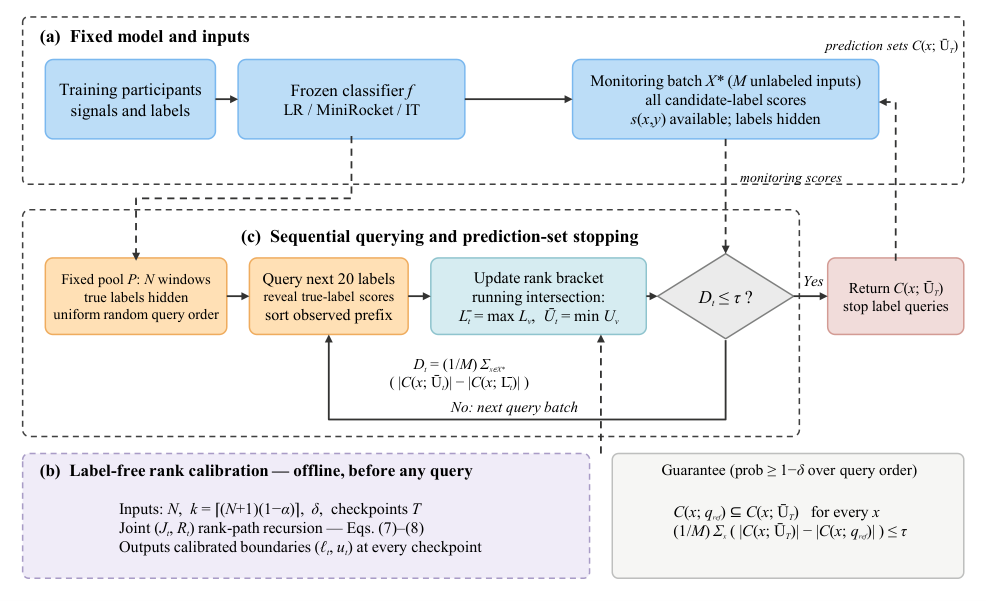

# Sequential reference preservation

**Sequential reference preservation for label-efficient set-valued prediction**

Author-review narrative revision targeting the **International Journal of Approximate Reasoning**. This branch retains the numerical evidence from the [PAA submission snapshot](https://github.com/Cyrano666/jrc-reference-emulation/releases/tag/submission-ready-2026-09-17) and updates the narrative and Elsevier manuscript format.

[Manuscript](paper/manuscript.pdf) · [LaTeX source](paper/latex/manuscript.tex) · [Author page](paper/Title_Page_and_Declarations.docx) · [Reproduction guide](docs/REPRODUCTION.md) · [Revision record](docs/IJAR_NARRATIVE_20260923.md)



The procedure brackets a fixed reference quantile from sequentially queried labels. Endpoint prediction sets turn that bracket into an observable cardinality difference on a monitoring batch. Querying stops at the specified tolerance and returns the upper-endpoint sets. A finite-population rank recursion calibrates the declared query checkpoints.

## Reported evidence

The seven-dataset main study contains 354 frozen classifier cases, and HHAR contributes 45 additional cases. All original figures, tables and numerical records are preserved.

| Dataset | JRC saved | Bonferroni HG saved | Uniform-prior CS saved | CS Beta(9,1) saved |
|---|---:|---:|---:|---:|
| USC-HAD | 23.67% | 17.91% | 11.74% | 15.33% |
| HHAR | 34.03% | 28.58% | 20.64% | 25.13% |

JRC is calibrated on the declared finite schedule. The original CS comparisons use bounds valid at every sampling time. This distinction is part of the reported comparison. The confidence event conditions on the fixed pool and uniform queries and controls mean set enlargement on the monitoring batch.

## Reproduce

Use Python 3.12 from the repository root:

```text
python -m pip install -r requirements.txt
python get_artifacts.py
python reproduce.py --smoke
```

The artifact download remains pinned to the original approximately 350 MB scientific snapshot. It provides frozen predictions and evaluation records. Main-study replay uses `python reproduce.py`; HHAR replay uses `python confirmation_hhar/reproduce.py`. If the full supplementary archive is already extracted, the download step is unnecessary. See docs/REPRODUCTION.md for boundary construction and joint-recursion commands.

## Files

| Path | Contents |
|---|---|
| paper/ | IJAR review manuscript, Elsevier source, author page and submission drafts |
| figures/ | Unchanged original figures and editable architecture |
| revision6/ | Locked JRC implementation, evaluation and summaries |
| revision7/ | Original prior-sensitivity diagnostic |
| confirmation_hhar/ | Additional confirmation protocol and implementation |
| revision/, revision5/ | Shared models, preprocessing and earlier study evidence |
| docs/ | Reproduction, data provenance and revision notes |

Directory names are retained because imports and protocol hashes depend on them. This branch adds no new experiments. The full official Guide for Authors was checked from the user-supplied saved webpage. See docs/IJAR_GUIDE_CHECK_20260923.md for completed checks and remaining author actions. The manuscript uses Elsevier's official class and numerical bibliography style. Submission and editorial assessment remain separate from this repository revision.
